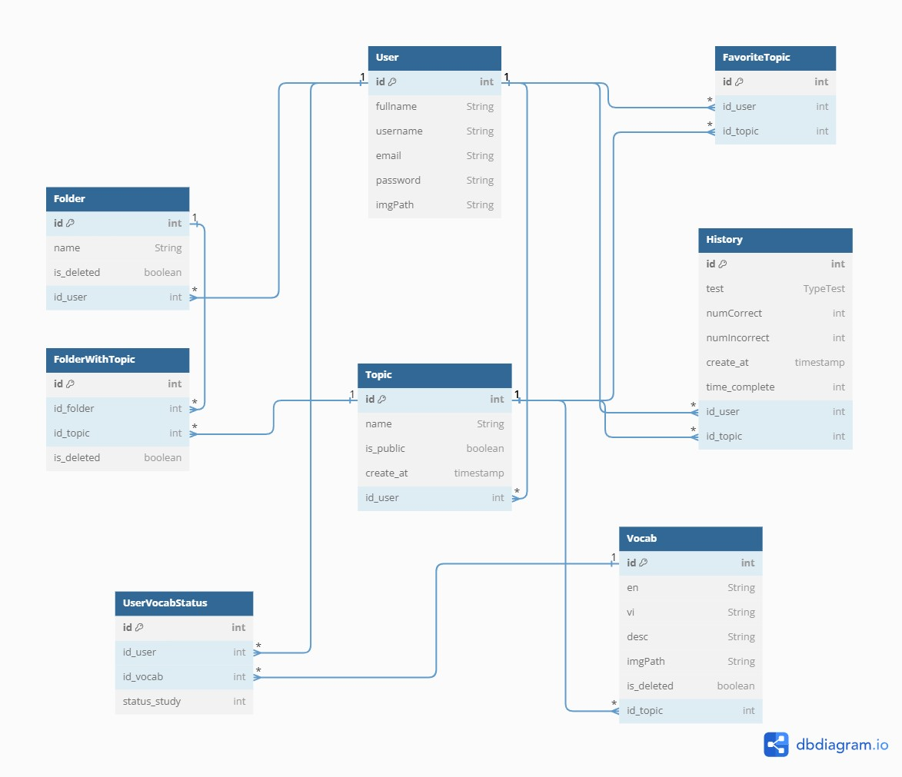
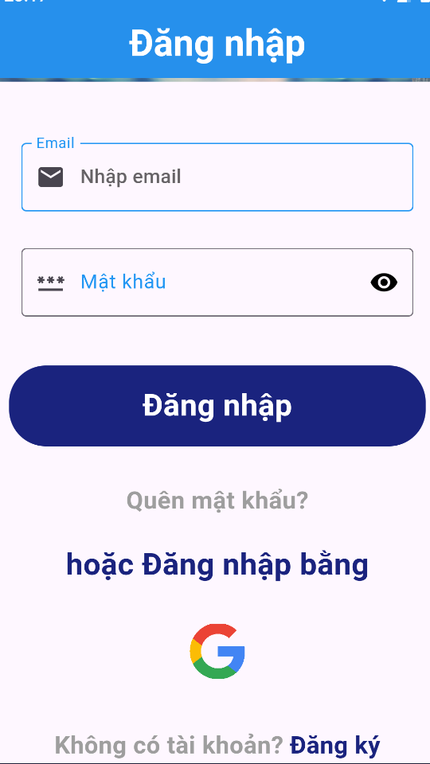
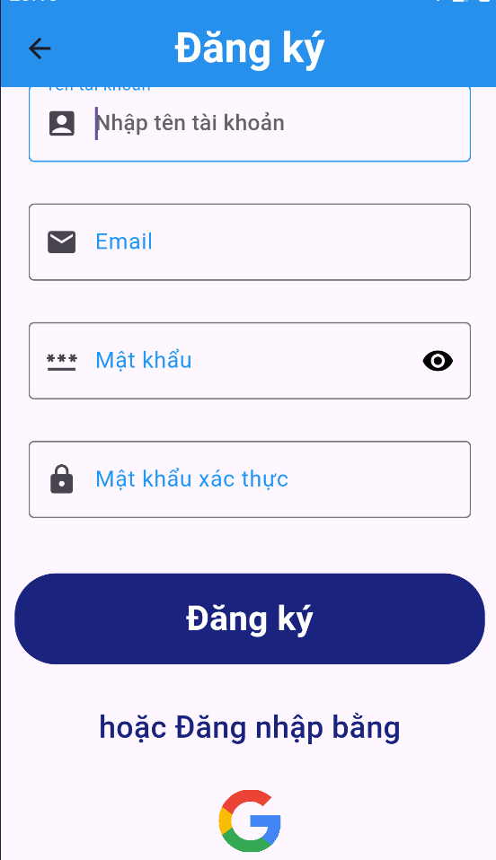
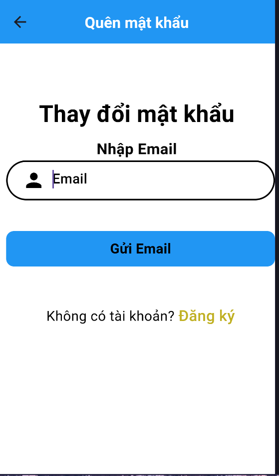
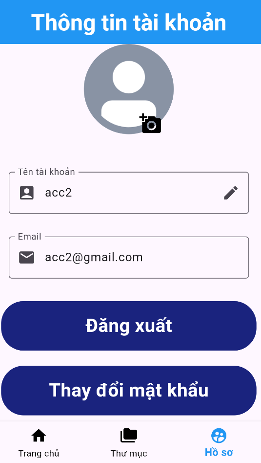
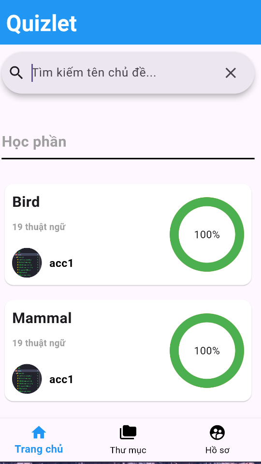
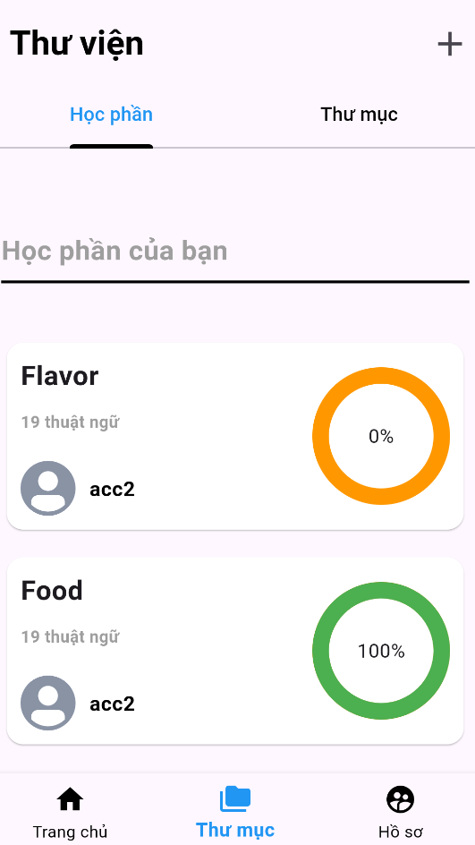
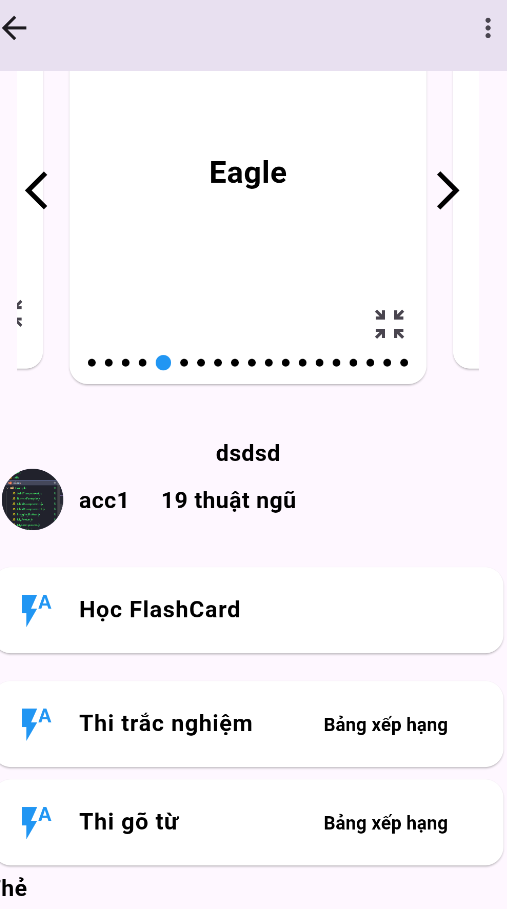

# Learning English Application

## Introduction

The application helps users learn English vocabulary in the form of flashcards, similar to the Quizlet app. Essentially, the app allows users to create their own topics containing vocabulary words on a specific subject, after which they can study and take quizzes in various formats.

## Features

- Account-related Features
- Search Topic
- Features for Creating and Managing Vocabulary Topics
- Features related to learning vocabulary in a topic
- Community Features
- Import/Export CSV

## ERD

## Demo

[Demo](https://www.youtube.com/watch?v=DFkdAkkFRdg)

## Screenshots

<h3>Sign In</h3>
  

<h3>Sign Up</h3>
  

<h3>Forgot Pasword</h3>
  

<h3>Profile</h3>
  

<h3>Home</h3>
  

<h3>Library</h3>
  

<h3>Detail Learing</h3>
  

## Tech Stack

**Programming Language:** Dart

**Databases:** Firebase, SQLite

## Requirements

- cupertino_icons: ^1.0.8
- sqflite: ^2.3.3
- path: ^1.9.0
- flip_card: ^0.7.0
- card_swiper: ^3.0.1
- flutter_tts: ^4.0.2
- csv: ^6.0.0
- file_picker: ^8.0.3
- path_provider: ^2.1.3
- open_file: ^3.3.2
- provider: ^6.1.2
- firebase_auth: ^4.19.5
- firebase_core: ^2.31.0
- google_sign_in: ^6.2.1
- cloud_firestore: ^4.17.3
- the_apple_sign_in: ^1.1.1
- crypt: ^4.3.1
- percent_indicator: ^4.2.3
- permission_handler: ^11.3.1
- external_path: ^1.0.3
- cached_network_image: ^3.3.1
- shared_preferences: ^2.2.3
- intl: ^0.19.0
- image_picker: ^1.1.1
- firebase_storage: ^11.7.5
- firebase_app_check: ^0.2.2+5
